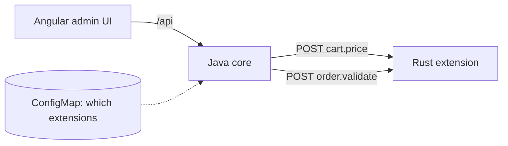

# Commerce Extensions

A small commerce backend that customers can **extend without changing its code**. Pricing rules and order checks live in separate services that register for *hooks*; the core calls them over HTTP, checks what they send back, and keeps working when one of them fails.

I built it to learn the stack used for pro-code extensibility of SaaS commerce software: a **Java** core, an extension written in **Rust**, an **Angular** admin UI, **Docker** images and **Kubernetes** manifests, with tests for every part.

| Part | Stack | Tests |
|---|---|---|
| `core/` | Java 21, JDK `HttpServer`, no runtime dependencies | 34 JUnit 5 tests |
| `extensions/discount-rs/` | Rust, axum, tokio | 10 tests, clippy clean |
| `admin-ui/` | Angular 21, signals, reactive forms, Vitest | 19 tests |
| `deploy/k8s/` | Kubernetes Deployments, Services, ConfigMap | schema-validated (v1.31, strict) |
| `.github/workflows/ci.yml` | GitHub Actions | runs all of the above and builds the 3 images |

## How it works



The core has two hooks:

| Hook | Called when | Extension answers |
|---|---|---|
| `cart.price` | a cart is priced | `{"adjustments":[{"sku":"MUG-CER","label":"Bulk 10%","amountCents":-645}]}` (sku optional for cart-level) |
| `order.validate` | an order is placed | `{"allowed":false,"reason":"At most 20 units of MUG-CER per order"}` |

Extensions are registered at runtime through the API or the admin UI, or at start-up from the `BOOTSTRAP_EXTENSIONS` variable (filled from a ConfigMap in Kubernetes). Each one has its own timeout (50 to 5000 ms) and can be switched off without being removed.

### The core does not trust extensions

Extension code belongs to someone else, so the core treats every answer as untrusted input:

- **All or nothing.** If one adjustment in a response is invalid (unknown sku, missing label, zero amount), none of that extension's adjustments apply and the quote carries a warning.
- **No discount larger than the line.** A line-level discount may not take a line below zero, counting earlier extensions' discounts too.
- **Total never below zero.** Cart-level discounts that exceed the value are capped, with a warning.
- **Timeouts.** A slow or unreachable extension is skipped after its timeout; pricing still answers.
- **Failure policy for validators.** `SKIP` places the order with a warning; `BLOCK` refuses the order because it could not be checked.
- Limits on response size (64 KB), number of adjustments (20), label length (80) and amounts.

Money is integer cents everywhere to avoid floating-point rounding.

## Run it

### With Docker Compose

```bash
docker compose up --build
```

Admin UI on http://localhost:4200, core API on http://localhost:8080. The Rust extension is registered for both hooks at start-up.

### On Kubernetes (kind or minikube)

```bash
docker build -t commerce-core:0.1.0 core
docker build -t discount-extension:0.1.0 extensions/discount-rs
docker build -t admin-ui:0.1.0 admin-ui
kind create cluster
kind load docker-image commerce-core:0.1.0 discount-extension:0.1.0 admin-ui:0.1.0
kubectl apply -k deploy/k8s
kubectl -n commerce port-forward svc/admin-ui 4200:80
```

Pods run as a non-root numeric user with dropped capabilities and a read-only root filesystem (core and extension), and have readiness/liveness probes and resource limits.

### Without containers

```bash
# 1. Rust extension on :8081
cd extensions/discount-rs && cargo run

# 2. Java core on :8080, registering the extension
cd core && mvn -q package
BOOTSTRAP_EXTENSIONS='[{"name":"Rust discount rules","hook":"cart.price","url":"http://localhost:8081/hooks/cart-price"}]' \
  java -jar target/commerce-core.jar

# 3. Angular UI on :4200 (proxies /api to :8080)
cd admin-ui && npm ci && npx ng serve
```

## Try the API

```bash
curl -X POST localhost:8080/api/quotes -H 'Content-Type: application/json' \
  -d '{"lines":[{"sku":"COFFEE-1KG","quantity":5},{"sku":"GRINDER-H","quantity":1}]}'
```

With the Rust extension registered, the subtotal of 184.40 EUR gets a bulk discount (-12.45) and a bundle discount (-5.00), for a total of 166.95 EUR.

| Method | Path | |
|---|---|---|
| GET | `/health` | liveness |
| GET | `/api/products` | demo catalog |
| GET, POST | `/api/extensions` | list, register |
| GET, PATCH, DELETE | `/api/extensions/{id}` | read, enable/disable, remove |
| POST | `/api/quotes` | price a cart |
| POST | `/api/orders` | place an order (422 if a validator rejects it) |
| GET | `/api/orders/{id}` | read an order |

## Tests

```bash
cd core && mvn verify                                   # 34 tests
cd extensions/discount-rs && cargo test                 # 10 tests
cd admin-ui && npx ng test --watch=false                # 19 tests
```

The Java API tests start the real server and real fake extensions on random ports, including one that answers too slowly, to check that the timeout works over actual HTTP.

## What was checked, and what was not

- All 63 tests pass. The Java tests were also run four times in a row to rule out flakiness.
- I ran the Rust extension and the Java core together, configured from the ConfigMap JSON, and checked by hand:
  - the bulk and bundle discounts;
  - a validator rejection (HTTP 422);
  - an extension going down mid-run: pricing still answered with a warning, and the `BLOCK` validator refused the order.
- The Kubernetes manifests pass strict schema validation. I have **not** run them on a live cluster yet; the CI pipeline builds the images.

## Limitations

- The extension registry and orders live in memory, so the core runs as a single replica. A real system would store them in a database and run several replicas.
- Extensions are called one after another. Parallel calls would be faster for independent pricing rules but would make the order of adjustments less predictable.
- No authentication on the admin API, and no signing of requests to extensions; both would be needed before real use.
- The catalog is a fixed demo list.

